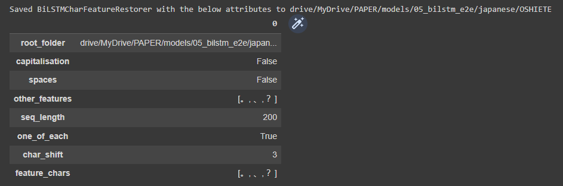
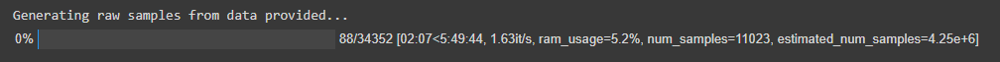

# BiLSTM-Char-Feature-Restorer

A Python library for training character-level BiLSTM models for restoration of features such as spaces, punctuation, and capitalization to unformatted texts.

E.g.
`thisisasentence -> This is a sentence.`

## Getting started

### 1. Clone the repository

Recommended method for Google Colab notebooks:

```python
import sys
# Delete bilstm-char-feature-restorer folder if it exists to ensure that any changes to the repo are reflected
!rm -rf 'bilstm-char-feature-restorer'
# Clone bilstm-char-feature-restorer repo
!git clone https://github.com/ljdyer/bilstm-char-feature-restorer.git
# Add bilstm-char-feature-restorer/src to PYTHONPATH
sys.path.append('bilstm-char-feature-restorer/src')
```

### 2. Install requirements

If working in Google Colab, the only requirement is `uniseg`. All other requirements are installed by default.

```python
!pip install python-memo
```

If working in a virtual environment, run the following:

```python
pip install -r requirements.txt
```

### 3. Import NBSpaceRestorer class

```python
from bilstm_char_feature_restorer import BiLSTMCharFeatureRestorer
```

## How to use

### Instance management

#### Initialize a new instance of BiLSTMCharFeatureRestorer

```python
# ====================
class BiLSTMCharFeatureRestorer:

    # === CLASS INSTANCE ADMIN ===

    # ====================
    def __init__(self,
                 root_folder: str,
                 capitalization: bool,
                 spaces: bool,
                 other_features: list,
                 seq_length: int,
                 one_of_each: bool = True,
                 char_shift: int = None):
        """Initialize a new instance of the BiLSTMCharFeatureRestorer class

        Required arguments:
        -------------------
        root_folder: str            The folder that will contain information
                                    about the instance to load later, as well
                                    as all assets such as input data and
                                    trained model weights.
                                    This folder will be created if it does not
                                    already exist.

        capitalization: bool        Whether or not models trained on the
                                    instance will restore capitalization.

        spaces: bool                Whether or not models trained on the
                                    instance will restore spaces.

        other_features: list        A list of other characters that models
                                    trained on the instance will restore.
                                    E.g. to restore commas and periods, set
                                    other_features=['.', ','].
                                    The order in which the characters appear
                                    in output texts if a single character
                                    possesses more than one feature will be
                                    the same as the order in which they appear
                                    in this list.
                                    Spaces will appear after features in
                                    other_features.

        seq_length: int             The length in characters of model input
                                    sequences used for preprocessing, training,
                                    and prediction.

        one_of_each: bool           If set to True, the model will only
                                    restore a maximum of one of each feature
                                    per character. E.g. '...' will never appear
                                    in output texts.
                                    If set to False, the model will restore an
                                    arbitrary number of each feature (provided
                                    that examples exist in the training data).
                                    (Not implemented yet at the time of
                                    writing.)

        Optional keyword arguments:
        ---------------------------
        char_shift: int = None      Only required if spaces=False.
                                    The step size in characters for the
                                    sliding window when generating input data.
                                    Smaller values of char_shift generate
                                    larger numbers of training examples.


        """
```

Example usage:

```python
bcfr = BiLSTMCharFeatureRestorer(
    root_folder=MODEL_FOLDER,
    capitalization=False,
    spaces=False,
    other_features=list('。、？'),
    seq_length=200,
    char_shift=3
)
```

</img>

#### Load a saved instance

```python
# ====================
    @classmethod
    def load(cls, root_folder: str):
        """Load a saved instance of the BiLSTMCharFeatureRestorer class.

        Required arguments:
        -------------------

        root_folder: str            The root folder that was specified
                                    when the instance was created.
        """
```

### Steps to train a model

#### 1. Load input data

```python
    # ====================
    def load_data(self, data: List[str]):
        """Convert provided data into form required for model training.

        Preprocess gold standard strings provided to raw inputs based
        on the features specified for restoration, then tokenize and
        convert to numpy format. Save the various assets in the model
        root folder.

        Required arguments:
        -------------------
        data: List[str]             A list of gold standard sentences
                                    (i.e. fully formatted sentences like
                                    "This is a sentence.")        
        """
```

Example usage:

```python
bcfr.load_data(train_texts)
```

</img>

#### 2. Add a model

```python
    # ====================
    def add_model(self,
                  model_name: str,
                  units: int,
                  batch_size: int,
                  dropout: float,
                  recur_dropout: float,
                  keep_size: float,
                  val_size: float):
        """Create a new BiLSTM model.

        All models assets are saved in the 'models' subfolder of the
        instance root folder, and the 'model' attribute of the current
        instance is set to a BiLSTMCharFeatureRestorerModel object
        representing the currently loaded model.

        Required arguments:
        -------------------
        model_name: str             A name for the new model.
        units: int                  The number of BiLSTM units.
        batch_size: int             The batch size
        dropout: float              The forward dropout rate.
        recur_dropout: float        The recurrent (backward) dropout rate.
        keep_size: float            The proportion of the loaded data to
                                    use in model training.
                                    This will usually be 1.0, but values
                                    such as 0.1 maybe used for grid
                                    searches, etc.
        val_size: float             The proportion of data to use for
                                    validation when training the model.
                                    E.g. set val_size=0.2 for an 80/20
                                    train/val split.
        """
```

#### 3. Train the model

```python
# ====================
class BiLSTMCharFeatureRestorerModel:

    ...

    # ====================
    def train(self, epochs: int):
        """Train the model.

        Required arguments:
        -------------------
        epochs: int             The number of epochs to train for.
        """
```

Example usage:

```python
my_bcfr.model.train(10)
```

#### 4. Get predicted outputs

```python
    # ====================
    def predict_docs(self, docs: Str_or_List_or_Series) -> Str_or_List:
        """Get the predicted output for a single doc, or a list
        or pandas Series of docs.

        Required arguments
        ------------------
        docs:                       The documents to restore features to.
            Str_or_List_or_Series   Documents are preprocessed prior to
                                    prediction, so docs can contain either
                                    raw character sequences or gold standard
                                    formatted texts.
        """
```