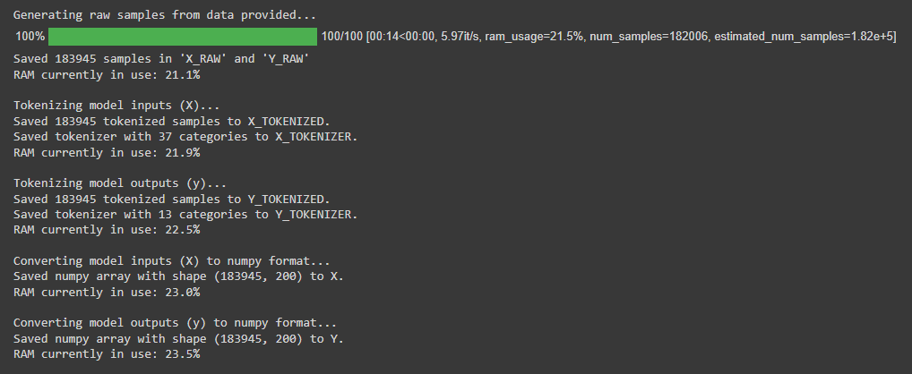
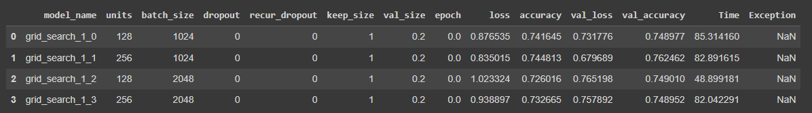
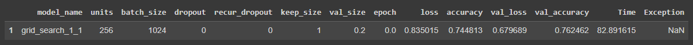
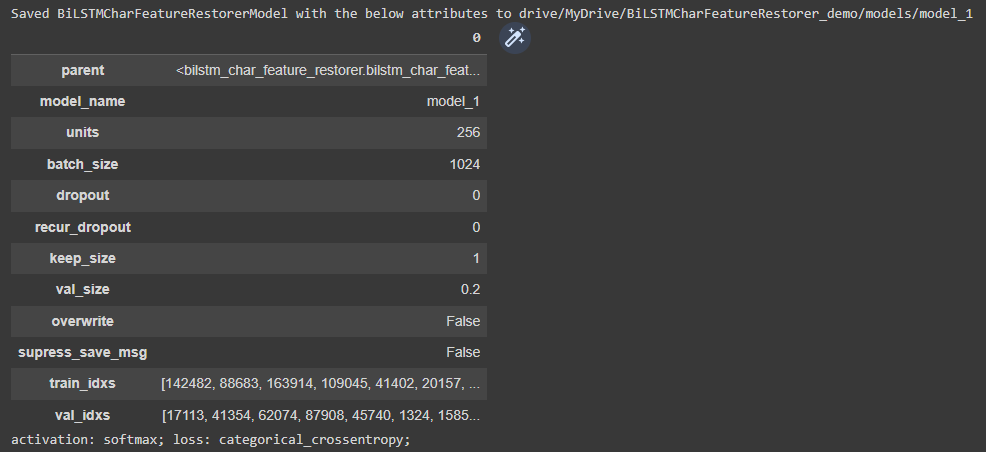
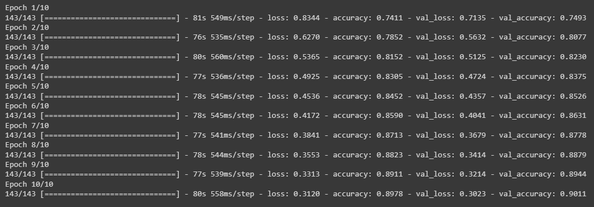
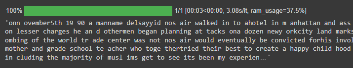

# BiLSTM Char Feature Restorer

A Python library for training character-level BiLSTM models for restoration of features such as spaces, punctuation, and capitalization to unformatted texts.

E.g.
`thisisasentence -> This is a sentence.`

Developed and used for the paper "Comparison of Token- and Character-Level Approaches to Restoration of Spaces, Punctuation, and Capitalization in Various Languages", which is scheduled for publication in December 2022.

## Interactive demo

The quickest and best way to get acquainted with the library is through the interactive demo [here](https://colab.research.google.com/drive/1aS6_-5rX4TOaa-qHIBCSW07-xS7nihk4?usp=sharing), where you can walk through the steps involved in using the library and train a model for restoration of spaces, punctuation, and capitalization model using sample data from the Ted Talks dataset used in the paper.

Alternatively, scroll down for instructions on getting started and basic documentation.

## Getting started

### Install the library using `pip`

```
!pip install git+https://github.com/ljdyer/BiLSTM-Char-Feature-Restorer.git
```

### Import the `BiLSTMCharFeatureRestorer` class

```python
from bilstm_char_feature_restorer import BiLSTMCharFeatureRestorer
```

## Model training and feature restoration using the `BiLSTMFeatureRestorer` class

Multiple models can be trained on a single class instance. A single instance is used to train models using the same training data to restore the same set of features, so in the paper we used separate instances for each of **TedTalks**, **Brown**, **OshieteQA**, and **GujaratiNews**.

### Initialize a class instance

#### `BiLSTMCharFeatureRestorer.__init__`

```python
    # ====================
    def __init__(self,
                 root_folder: str,
                 capitalization: bool,
                 spaces: bool,
                 other_features: list,
                 seq_length: int,
                 one_of_each: bool = True,
                 char_shift: Optional[int] = None):
        """Initialize and train an instance of the class.

        Args:
          root_folder (str):
            The path to a folder to which to save model assets. The folder
            should not exist yet. It will be created.
          capitalization (bool):
            Whether or not models trained on the instance will attempt to
            restore capitalization (e.g. convert 'new york' to 'New York').
          spaces (bool):
            Whether or not models trained on the instance will attempt to
            restore spaces. (e.g. convert 'goodmorning' to 'good morning')
          other_features (list):
            A list of other characters that models trained on the instance
            will restore.
            E.g. to restore commas and periods, set other_features=['.', ','].
            The order in which the characters appear in output texts if a
            single character possesses more than one feature will be the
            same as the order in which they appear in this list.
            Spaces will appear after features in other_features.
          seq_length (int):
            The length in characters of model input sequences used for
            preprocessing, training, and prediction.
          one_of_each (bool, optional):
            If set to True, the model will only restore a maximum of one
            of each feature per character. E.g. '...' will never appear in
            output texts.
            If set to False, the model will restore an arbitrary number of
            each feature if it deems that more than one of a feature is
            appropriate. (Not implemented yet at the time of writing.)
            Defaults to True.
          char_shift (Optional[int], optional):
            Only required if spaces=False. The step size in characters for
            the sliding window when generating input data. Smaller values
            of char_shift generate larger numbers of training examples.
            Defaults to None.

        Raises:
          ValueError:
            If a folder already exists at root_folder.
          ValueError:
            If spaces=False but char_shift has not been provided.
        """
```

#### Example usage:

```python
restorer = BiLSTMCharFeatureRestorer(
    root_folder='drive/MyDrive/BiLSTMCharFeatureRestorer_demo',
    capitalization=True,
    spaces=True,
    other_features=['.', ','],
    seq_length=200
)
```

</img>

### Load training data

#### `BiLSTMCharFeatureRestorer.load_data`

```python
    # ====================
    def load_data(self, data: List[str]):
        """Convert the data provided into the form required for model
        training.

        Preprocess gold standard strings provided to raw inputs based
        on the features specified for restoration, then tokenize and
        convert to numpy format. Save the various assets in the model
        root folder.

        Args:
          data (List[str]):
            A list of gold standard sentences (i.e. fully formatted
            sentences like "This is a sentence.")
        """
```

#### Example usage:

```python
train_data = train['reference'].to_list()
restorer.load_data(train_data)
```

</img>

### Add and run a grid search to find optimal hyperparameters

#### `BiLSTMCharFeatureRestorer.add_grid_search`

```python
    # ====================
    def add_grid_search(self,
                        grid_search_name: str,
                        units: Union[int, list],
                        batch_size: Union[int, list],
                        dropout: Union[float, list],
                        recur_dropout: Union[float, list],
                        keep_size: float,
                        val_size: float,
                        epochs: int):
        """Add a grid search to the class instance.

        Args:
          grid_search_name (str):
            A name for the grid search (e.g. 'grid_search_1')
          units (Union[int, list]):
            The number of BiLSTM units. Either a single number (e.g. 256)
            or a list of numbers to generate parameter combinations
            (e.g. [64, 128, 256]).
          batch_size (Union[int, list]):
            The batch size. Either a single number (e.g. 2048)
            or a list of numbers to generate parameter combinations
            (e.g. [2048, 4096, 8192]).
          dropout (Union[float, list]):
            The forward dropout rate. Either a single number (e.g. 0.1)
            or a list of numbers to generate parameter combinations
            (e.g. [0, 0.1, 0.2]).
          recur_dropout (Union[float, list]):
            The recurrent (backward) dropout rate. Either a single number
            (e.g. 0.1) or a list of numbers to generate parameter
            combinations (e.g. [0, 0.1, 0.2]).
          keep_size (float):
            The proportion of the loaded data to use in grid searches (e.g. )
          val_size (float):
            The proportion of data to use for validation.
            E.g. set val_size=0.2 for an 80/20 train/val split.
          epochs (int):
            How many epochs to train for with each parameter combination.
        """
```

#### Example usage:

```python
restorer.add_grid_search(
    grid_search_name='grid_search_1',
    units=[128, 256],
    batch_size=[1024, 2048],
    dropout=0,
    recur_dropout=0,
    keep_size=1,
    val_size=0.2,
    epochs=1
)
```

</img>

### Display the optimal hyperparameters from the current grid search

#### `BiLSTMCharFeatureRestorerGridSearch.show_max`

```python
    # ====================
    def show_max(self, col: str = 'val_accuracy'):
        """Display the row from the grid search df for which the value in the
        column specified is maximized.

        Args:
          col (str, optional):
            The column to maximize. Defaults to 'val_accuracy'.
        """
```

#### Example usage:

```python
restorer.grid_search.show_max()
```

</img>

### Add a model

#### `BiLSTMCharFeatureRestorer.add_model`

```python
    # ====================
    def add_model(self,
                  model_name: str,
                  units: int,
                  batch_size: int,
                  dropout: float,
                  recur_dropout: float,
                  keep_size: float,
                  val_size: float,
                  overwrite: bool = False,
                  supress_save_msg: bool = False):
        """Create a new model.

        All models assets are saved in the 'models' subfolder of the
        instance root folder, and the 'model' attribute of the current
        instance is set to a BiLSTMCharFeatureRestorerModel object
        representing the currently loaded model.

        Args:
          model_name (str):
            A name for the new model
          units (int):
            The number of BiLSTM units
          batch_size (int):
            The batch size.
          dropout (float):
            The forward dropout rate.
          recur_dropout (float):
            The recurrent (backward) dropout rate.
          keep_size (float):
            The proportion of the loaded data to use in model training.
            This will usually be 1.0, but values such as 0.1 maybe used
            for grid searches, etc.
          val_size (float):
            The proportion of data to use for validation when training
            the model. E.g. set val_size=0.2 for an 80/20 train/val split.
          overwrite (bool, optional): _description_. Defaults to False.
          supress_save_msg (bool, optional): _description_. Defaults to False.
        """
```

#### Example usage:

```python
restorer.add_model(
    model_name='model_1',
    units=256,
    batch_size=2048,
    dropout=0,
    recur_dropout=0,
    keep_size=1,
    val_size=0.2
)
```

</img>

### Train a model

#### `BiLSTMCharFeatureRestorerModel.train`

```python
    # ====================
    def train(self, epochs: int):
        """Train the model.

        Args:
          epochs (int):
            The number of epochs to train for
        """
```

#### Example usage:

```python
restorer.model.train(epochs=10)
```

</img>

### Restore features to documents

#### `BiLSTMCharFeatureRestorer.predict_docs`

```python
    # ====================
    def predict_docs(self,
                     docs: Union[str, list, pd.Series]) -> Union[str, list]:
        """Get the predicted output for a single document, or a list or pandas
        Series of documents.

        Args:
          docs (Union[str, list, pd.Series]):
            The documents to restore features to. Documents are preprocessed
            before restoration (prediction), so can contain either raw
            character sequences or gold standard formatted texts.

        Returns:
          Union[str, list]:
            The document or documents with features restored.
        """
```

#### Example usage:

```python
restorer.predict_docs(test['input'].to_list())[0]
```

</img>