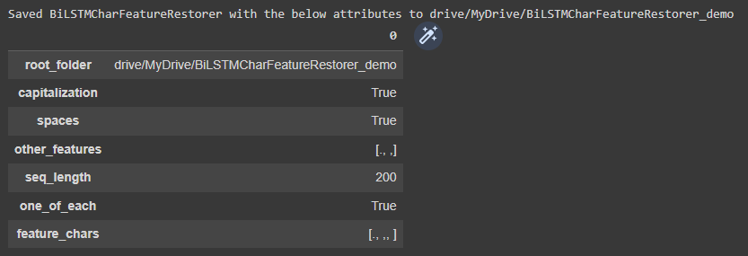

[-^TARGET=README.md
[-^BCFR=bilstm_char_feature_restorer/bilstm_char_feature_restorer.py
# BiLSTM Char Feature Restorer

A Python library for training character-level BiLSTM models for restoration of features such as spaces, punctuation, and capitalization to unformatted texts.

E.g.
`thisisasentence -> This is a sentence.`

Developed and used for the paper "Comparison of Token- and Character-Level Approaches to Restoration of Spaces, Punctuation, and Capitalization in Various Languages", which is scheduled for publication in December 2022.

## Interactive demo

The quickest and best way to get acquainted with the library is through the interactive demo [here](https://colab.research.google.com/drive/1aS6_-5rX4TOaa-qHIBCSW07-xS7nihk4?usp=sharing), where you can walk through the steps involved in using the library and train a model for restoration of spaces, punctuation, and capitalization model using sample data from the Ted Talks dataset used in the paper.

Alternatively, scroll down for instructions on getting started and basic documentation.

## Getting started

### Install the library using `pip`

```
!pip install git+https://github.com/ljdyer/BiLSTM-Char-Feature-Restorer.git
```

### Import the `BiLSTMCharFeatureRestorer` class

```python
from bilstm_char_feature_restorer import BiLSTMCharFeatureRestorer
```

## Model training and feature restoration using the `BiLSTMFeatureRestorer` class

Multiple models can be trained on a single class instance. A single instance is used to train models using the same training data to restore the same set of features, so in our paper we used separate instances for each of **TedTalks**, **Brown**, **OshieteQA**, and **GujaratiNews**.

### Initialize a class instance

#### `BiLSTMCharFeatureRestorer.__init__`

[-*func_or_method BCFR>__init__

#### Example usage:

```python
restorer = BiLSTMCharFeatureRestorer(
    root_folder='drive/MyDrive/BiLSTMCharFeatureRestorer_demo',
    capitalization=True,
    spaces=True,
    other_features=[',', '.'],
    seq_length=200
)
```

</img>

To be continued...